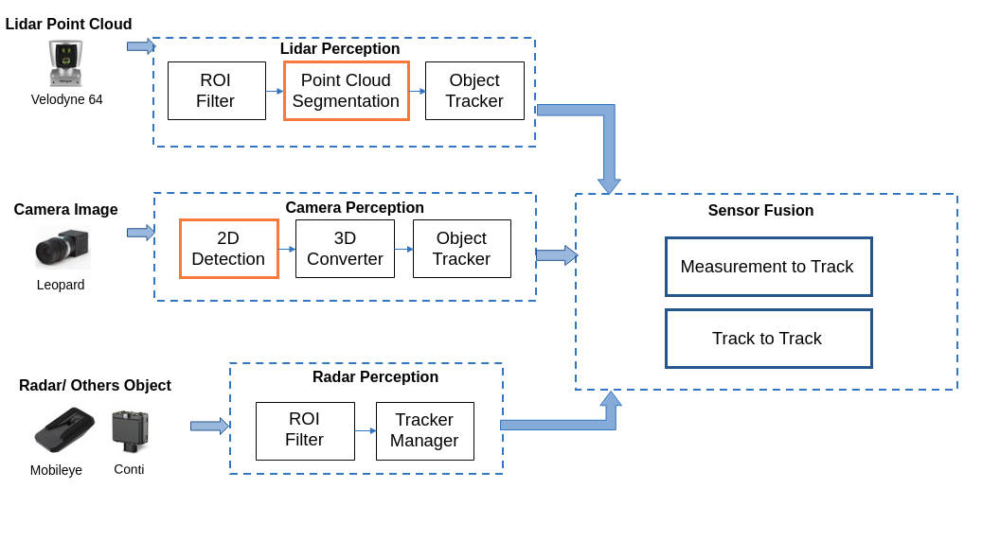

# Apollo Perception Standalone in ROS

> **Status (2026):** Maintenance restarted. This project ports parts of Apollo 3.0
> perception into a standard ROS workflow. Original Apollo code is licensed under
> Apache-2.0. See [LICENSE](LICENSE) and [NOTICE](NOTICE).

[Apollo](https://github.com/ApolloAuto/apollo) is the most mature and sophisticated autonomous driving platform that is open source right now. 

However, there are some limitations.
  * Apollo (r3.0) is built upon a customized ROS environment, which is not compatible with normal ROS packages / plugins. 
  * Apollo (r3.5) abandons ROS and uses Cyber RT instead. 
  * If you want to understand their code and test it with your own application, you will need to have a good understanding of their framework before you can make any modifications.

Have you wondered, what if **everything can be run as a standard ROS node** and you can use all the familiar tools that are available in ROS? Then this repository is what you need!

|  | 
|:--:| 
| **Apollo Perception Architecture** |

|  | 
|:--:| 
| **Apollo Perception Overview** |

|  | 
|:--:| 
| **Perception with demo-2.0.bag** |

The obstacle perception module in Apollo (r3.0) is extracted and modified so that it can be run as a normal ROS node. Everything is inside docker environment. Detailed steps of building and running the perception module are listed as follows.

I myself find learning Apollo's approach in perception very beneficial to helping me understand how the perception architecture is set up. I hope you find this repo useful as well.

**All contributions are welcome!!** There are so many things that can be improved. Please raise issues and/or make pull requests if you would like to work on it too. Thank you.

## Current status

This repository is a **historical and educational ROS port** of Apollo 3.0
perception. It is actively maintained again as of 2026, with a focus on
documentation, issue triage, license clarity, and reproducibility guidance.

It is **not** a production autonomous driving stack.

## Who is this for?

- Students and researchers learning Apollo-style perception architecture
- Developers who want to experiment with LiDAR / camera / fusion pipelines in ROS
- Maintainers adapting legacy Apollo perception code to teaching labs or simulators

## Known limitations

- Requires a legacy software stack (Ubuntu 14.04, CUDA 8, old Docker GPU runtime)
- Continental radar bags use Protobuf messages and are not fully supported
- Modern GPUs (RTX series) often fail without rebuilding CUDA artifacts
- No ego-motion compensation, sequence fuser, or planning modules (see [ROADMAP.md](ROADMAP.md))

## Maintenance roadmap

See [ROADMAP.md](ROADMAP.md) for the 2026 plan. Initial focus:

1. License and attribution clarity
2. Issue triage and documentation
3. Demo bag and environment matrix
4. Lightweight CI and contribution guidelines

## Environment Information
The system is tested on Nvidia GeForce GTX 1080 Ti and 1070 Max-Q. Please install **Nvidia Driver**, [**Docker**](https://docs.docker.com/install/linux/docker-ce/ubuntu/), and [**Nvidia Docker**](https://github.com/NVIDIA/nvidia-docker).

| **Dependencies**                  	| Image Environment  	|
|-----------------------------------	|--------------------	|
| Nvidia Driver (Tested on 384.130) 	| Ubuntu 14.04       	|
| Nvidia Docker (Tested on 2)       	| Cuda 8.0 + Cudnn 7 	|

## Building and Running
1. Clone Repository in Host
```
mkdir ~/shared_dir && cd ~/shared_dir
git clone https://github.com/cedricxie/apollo_perception_ros
```

2. Pull Docker Image  
```docker pull cedricxie/apollo-perception-ros```

3. Enter Docker Container  
```cd ~/shared_dir/apollo_perception_ros && ./docker/run.sh```

4. Make ROS Packages
```
cd ~/shared_dir/apollo_perception_ros/
catkin build
source devel/setup.bash
```

5. Launch Perception Node  
```roslaunch vehicle_base detect_sim.launch```

6. Playback Demo-2.0.bag from Apollo  
```rosbag play ~/shared_dir/demo-2.0.bag --clock```  

See **[docs/DEMO_BAG.md](docs/DEMO_BAG.md)** for download links and setup. The
original Apollo open data platform (`http://data.apollo.auto`) may be
unavailable; a verified maintainer mirror is documented there.

## Known issues
1. During building, a C++11 toolchain error may appear. Running `catkin build` again sometimes succeeds. If it persists, verify you are using the provided Docker image and compiler toolchain.

```
/usr/include/c++/4.8/bits/c++0x_warning.h:32:2: error: #error This file requires compiler and library support for the ISO C++ 2011 standard. This support is currently experimental, and must be enabled with the -std=c++11 or -std=gnu++11 compiler options.
```

2. Continental radar detection messages are in Protobuf format inside the ROS bag. Therefore it is not currently supported. However if you have your own radar, you can utilize the modest radar detector in the perception module to integrate into the system.

## Roadmap

Longer-term technical goals are tracked in [ROADMAP.md](ROADMAP.md), including:

1. Ego motion compensation
2. Sequence type fuser
3. Prediction / Planning modules (out of current scope)
